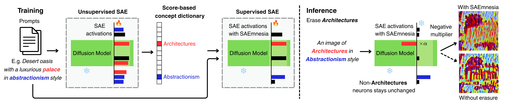

<div align="center">

<h1>SAEmnesia</h1>

<p><strong>SAEmnesia: Erasing Concepts in Diffusion Models with Supervised Sparse Autoencoders</strong></p>

<p>
  <a href="https://eidoslab.github.io/SAEmnesia">Project Page</a> •
  <a href="https://arxiv.org/abs/2509.21379">Paper (ICML 2026)</a>
</p>

<p>
  
  
</p>

</div>

<div align="center">
  
</div>

---

## Repository Structure

```
SAEmnesia/
├── SAE/                          # SAE architecture and hooked diffusion pipelines
├── utils/                        # Unlearning hook implementations
├── UnlearnCanvas_resources/      # Class / style lists from UnlearnCanvas
├── scripts/
│   ├── download_checkpoint.py           # Download SAE checkpoint from HuggingFace
│   ├── sample_unlearning_cls_distr.py   # Step 1: generate images with unlearning
│   ├── run_acc_all_cls.py               # Step 2: run full evaluation pipeline
│   ├── accuracy_unlearncanvas_cls_fast.py
│   ├── avg_accuracy_cls.py
│   ├── finetuning/               # (coming soon)
│   └── dataset/                  # (coming soon)
└── requirements.txt
```

---

## Setup

```bash
git clone https://github.com/EIDOSLAB/SAEmnesia.git
cd SAEmnesia
pip install -r requirements.txt
```

---

## Pretrained Assets

Download the following files and place them wherever you prefer (paths are passed as CLI arguments):

| Asset | Source |
|-------|--------|
| SAE checkpoint | [leno3003/SAEmnesia](https://huggingface.co/leno3003/SAEmnesia) on HuggingFace — see below |
| `class_params.pth` | [Google Drive](https://drive.google.com/drive/folders/1NoFDrjJ3dYmadufV2pK203ZED2pZ_hsB?usp=sharing) — see below |
| `cls_latents_dict_unet.up_blocks.1.attentions.1.pkl` | [Google Drive](https://drive.google.com/drive/folders/1NoFDrjJ3dYmadufV2pK203ZED2pZ_hsB?usp=sharing) — see below |
| UnlearnCanvas diffusion model (`style50`) | [Google Drive](https://drive.google.com/drive/folders/18tN-7LuxQ89I-MDSjtB5to2dGHDMHyqb) — see below |
| `style50.pth` and `style50_cls.pth` (classifiers) | [Google Drive](https://drive.google.com/drive/folders/1AoazlvDgWgc3bAyHDpqlafqltmn4vm61) — see below |

### Downloading the SAE checkpoint

Use the provided script to download the checkpoint from HuggingFace:

```bash
python scripts/download_checkpoint.py /path/to/save/sae_checkpoint
```

The checkpoint will be saved to the directory you specify (created automatically if it does not exist).

### Downloading the UnlearnCanvas diffusion model

```bash
gdown --folder https://drive.google.com/drive/folders/18tN-7LuxQ89I-MDSjtB5to2dGHDMHyqb \
    -O /path/to/save/style50
```

### Downloading the classifiers (`style50.pth` and `style50_cls.pth`)

```bash
gdown --folder https://drive.google.com/drive/folders/1AoazlvDgWgc3bAyHDpqlafqltmn4vm61 \
    -O /path/to/save/classifiers
```

### Downloading `class_params.pth` and `cls_latents_dict_unet.up_blocks.1.attentions.1.pkl`

```bash
gdown --folder "https://drive.google.com/drive/folders/1NoFDrjJ3dYmadufV2pK203ZED2pZ_hsB?usp=sharing" \
    -O /path/to/save/sae_assets
```

---

## Reproducing the Main Results

### Step 1 — Generate images with SAEmnesia unlearning

```bash
accelerate launch --num_processes <N_GPUS> scripts/sample_unlearning_cls_distr.py \
    --pipe_checkpoint /path/to/unlearncanvas/style50 \
    --hookpoint unet.up_blocks.1.attentions.1 \
    --sae_checkpoint /path/to/sae_checkpoint \
    --class_latents_path /path/to/cls_latents_dict_unet.up_blocks.1.attentions.1.pkl \
    --class_params_path /path/to/class_params.pth \
    --seed 188 \
    --steps 100 \
    --output_dir /path/to/output/images
```

### Step 2 — Evaluate unlearning accuracy (UA, IRA, CRA)

```bash
PYTHONPATH=. python scripts/run_acc_all_cls.py \
    --input_dir /path/to/output/images \
    --output_dir /path/to/output/eval_results \
    --style_ckpt /path/to/classifier_checkpoints/style50.pth \
    --class_ckpt /path/to/classifier_checkpoints/style50_cls.pth \
    --batch_size 128
```

This prints **UA** (Unlearning Accuracy), **IRA** (In-domain Retention Accuracy), and **CRA** (Cross-domain Retention Accuracy).

---

## Citation

```bibtex
@inproceedings{cassano2026saemnesia,
  title     = {{SAE}mnesia: Erasing Concepts in Diffusion Models with Supervised Sparse Autoencoders},
  author    = {Enrico Cassano and Riccardo Renzulli and Marco Nurisso and Mirko Zaffaroni and Alan Perotti and Marco Grangetto},
  booktitle = {Forty-third International Conference on Machine Learning},
  year      = {2026},
}
```

---

## Acknowledgements

This work builds upon [SAeUron](https://github.com/cywinski/SAeUron) by Cywinski et al. We thank the authors for releasing their code.

---

<div align="center">
<sub>© 2026 EIDOSLab — University of Turin</sub>
</div>
